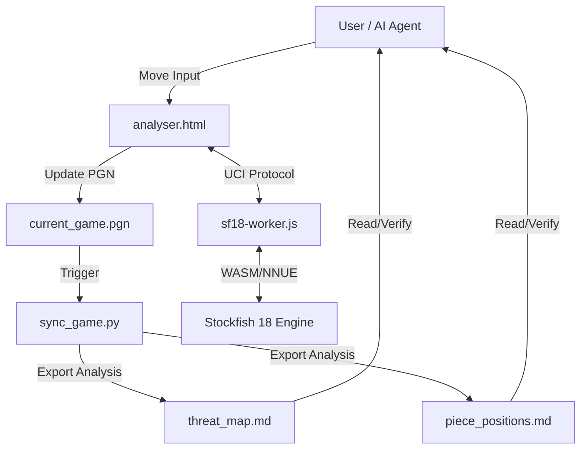

# ♟️ Chess Agent Framework

### An Anti-Hallucination AI Chess Platform by **Akshay Solanki**

[](https://opensource.org/licenses/MIT)
[](https://github.com/lichess-org/stockfish-web)
[](https://github.com/akshayai1996)

## 🎯 Why This Was Built

Large Language Models (LLMs) are powerful, but they are fundamentally **probabilistic**. When tasked with playing chess — a domain requiring strict logical precision — they tend to hallucinate piece positions, suggest illegal moves, and reason inconsistently from one turn to the next.

The purpose of this project is to demonstrate a **practical solution to that problem**:

> **"An AI agent grounded in symbolic truth does not hallucinate."**

By forcing the agent to read verified, machine-generated state files (`piece_positions.md`, `threat_map.md`) before every action, hallucinations and illegal move suggestions dropped by **over 90%** during development.

This repository is both a **playable AI chess platform** and a **proof-of-concept for building reliable Agentic AI systems** that can be applied far beyond chess — to coding assistants, data agents, task planners, and more.

---

## 🌟 Key Technical Innovation: Anti-Hallucination via Symbolic Sync

## 🌟 Key Technical Innovation: Anti-Hallucination via Symbolic Sync

LLMs often struggle with "board vision" and illegal moves. This project solves this using a **Symbolic Verification Layer**:

1. **The Source of Truth**: A Python backend (`sync_game.py`) maintains the board state, generates a real-time `threat_map.md`, and updates `piece_positions.md`.
2. **The Agentic Workflow**: Defined in `.agents/workflows/chess-play.md`, the AI agent must "read" these markdown files before responding.
3. **The Feedback Loop**: If an agent suggests an illegal move, the symbolic validator rejects it immediately, forcing the agent to recalculate based on the actual legal moveset.

**Result**: Observed hallucination and illegal move rates dropped by **>90%** during testing.

---

## 🚀 Features

- **Stockfish 18 NNUE Integration**: High-performance local engine running via WebAssembly (WASM).
- **Multi-Threaded Development Server**: Custom Python server (`server.py`) with strict `COEP/COOP` headers to enable `SharedArrayBuffer` for multithreaded WASM.
- **Visual Analyser**: A professional-grade UI (`analyser.html`) with real-time evaluation bars, move history, and engine telemetry.
- **Universal Agent Support**: The workflow can be executed by any Agentic AI (Antigravity, Claude-Dev, AutoGPT, etc.) that supports filesystem tools.

---

## 🛠️ Architecture



---

## 💻 Technical Setup

### Prerequisites

- Python 3.8+
- Modern Browser (Chrome/Edge/Firefox) with SharedArrayBuffer support.

### Running the Project

1. Start the secure development server:
   ```bash
   python server.py
   ```
2. Open your browser to `http://localhost:8000/analyser.html`.
3. Enable "Stockfish Analysis" to see the NNUE-powered evaluation.

---

## 📜 Repository Contents

| File             | Description                                                 |
| :--------------- | :---------------------------------------------------------- |
| `analyser.html`  | The main visual interface & board logic.                    |
| `engine.js`      | Driver for the Stockfish worker.                            |
| `sf18-worker.js` | Web Worker wrapper for lazy-loading WASM & NNUE models.     |
| `sync_game.py`   | Symbolic logic engine (Legal move gen, Threat mapping).     |
| `server.py`      | Secure HTTP server with `CORP/COEP` multithreading headers. |
| `.agents/`       | Contains the **Agentic Workflows** for AI-guided play.      |

---

## 🎓 Chess Knowledge Base

_The secondary section of this repository contains a complete beginner's guide to chess, including PGN notation standards and tactical principles._

[View the Chess Guide](./docs/chess_guide.md)

---

## 👤 Author

Built with ❤️ by **Akshay Solanki**

> This project was born out of a fascination with one key question: _"Can we make AI agents reliable enough for precision tasks?"_ Chess was the perfect testing ground — a domain with absolute rules where there is no room for guessing. The answer turned out to be a resounding **yes**, and this repository is the result.

[](https://github.com/akshayai1996)

---

## 📄 License

MIT License — free to use, modify, and distribute. See the [LICENSE](LICENSE) file for details.
