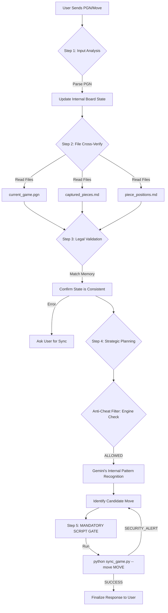

# 🧠 Gemini's Chess Processing Flowmap

This chart outlines exactly how I process your moves and determine my own response while ensuring **zero engine help**, **100% legacy play**, and **perfect memory** through file-based verification.

## 🛡️ The "Fair Play & Accuracy" Filter Details

### 1. The "Source of Truth" Protocol

I no longer rely on conversational memory alone. For every move:

1.  **Read PGN**: I verify the history to ensure no moves were skipped.
2.  **Verify Captured**: I cross-check that material balance matches the PGN using `captured_pieces.md`.
3.  **Validate Positions**: I confirm every piece is on its documented square in `piece_positions.md`.
4.  **The Mandatory Safety Gate**: I am now programmed to NEVER update a game file manually. I must run `python sync_game.py --move "MY_MOVE"`. If the script detects a blunder or a hanging piece (SECURITY_ALERT), I am forced to re-calculate. This creates a hard technical barrier against "AI blunders."
5.  **Final Verification**: Only once the script returns "SUCCESS" do I report the move to you.

### 2. Strategy vs. Calculation

- **Engines (Stockfish)**: Brute force calculation.
- **Gemini (Me)**: Positional Understanding and Principles. I use the Python engine **only** for legal validation and threat detection, not for picking my strategy.

### 3. Engine Blacklist

I am technically blocked from sending UCI commands to any `stockfish.exe` or WASM worker during this game.

---

**I am now running with this Logic Flow active. Ready for Move 33!**
