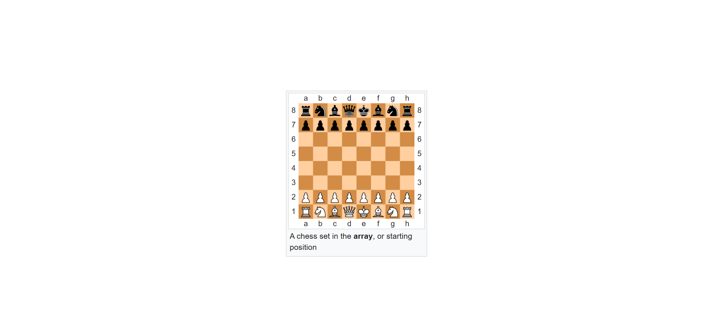
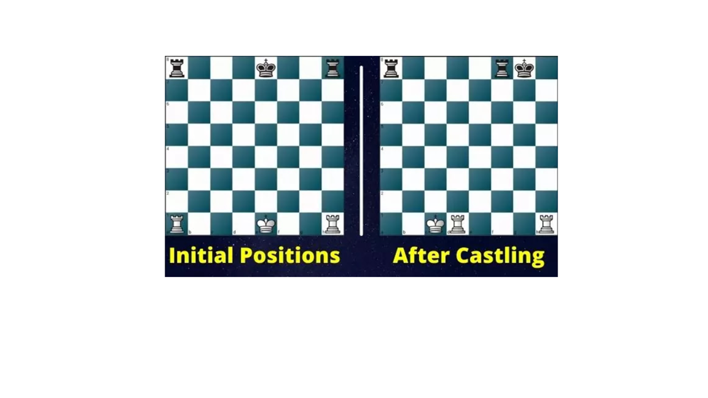
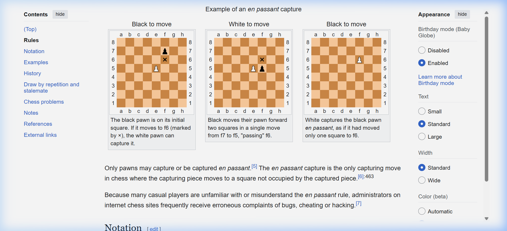

# ♟️ Chess: Complete Rules & Guide

_A comprehensive guide covering all official chess rules with illustrations._

---

## 🎯 1. Objective

The goal is **Checkmate** — attack the opponent's King so it has no legal escape.

- **Check**: King is under attack but can escape.
- **Checkmate**: King is in check with no legal way out. Game ends immediately.
- **Stalemate**: The player to move has no legal moves but is NOT in check. This is a **Draw**.

---

## 🏁 2. Starting Position

_Standard starting position. White is always on the bottom. Bottom-right square must be light._

Each player starts with **16 pieces**:

- 1 King, 1 Queen
- 2 Rooks, 2 Bishops, 2 Knights
- 8 Pawns

> **White always moves first.**

---

## 🗺️ 3. Algebraic Notation (PGN)

| Symbol   | Meaning                  |
| -------- | ------------------------ |
| `K`      | King                     |
| `Q`      | Queen                    |
| `R`      | Rook                     |
| `B`      | Bishop                   |
| `N`      | Knight                   |
| _(none)_ | Pawn                     |
| `x`      | Capture (e.g. `Bxe5`)    |
| `+`      | Check (e.g. `Qh5+`)      |
| `#`      | Checkmate (e.g. `Qxf7#`) |
| `O-O`    | Kingside Castle          |
| `O-O-O`  | Queenside Castle         |

---

## ⚔️ 4. How Each Piece Moves

| Piece      | Movement                                                                 |
| ---------- | ------------------------------------------------------------------------ |
| **King**   | One square in any direction                                              |
| **Queen**  | Any number of squares in any direction                                   |
| **Rook**   | Any number of squares horizontally or vertically                         |
| **Bishop** | Any number of squares diagonally (stays on own colour)                   |
| **Knight** | "L-shape": 2 squares one way, 1 perpendicular. **Can jump over pieces.** |
| **Pawn**   | 1 square forward (2 on first move). Captures **diagonally**.             |

---

## 🏰 5. Castling

Castling is a special move involving the King and a Rook. It is the **only move** where two pieces move at once.

_Left: Kingside castling (O-O). Right: Queenside castling (O-O-O)._

**How it works:**

- The King moves 2 squares towards the Rook.
- The Rook jumps to the other side of the King.

**Castling is NOT allowed if:**

- The King has previously moved.
- The Rook involved has previously moved.
- The King is currently in check.
- The King passes through or lands on an attacked square.
- Any piece is between the King and the Rook.

---

## 👻 6. En Passant

A special pawn capture that can only happen **immediately after** a pawn advances two squares from its starting position.

_The white pawn on e5 can capture the black pawn that just moved d7→d5, landing on d6._

**Rules:**

- Only a pawn that is on the **5th rank** can perform en passant.
- The capture must happen **on the very next move** — the right expires immediately.
- The capturing pawn lands on the square the enemy pawn passed through.

---

## 🥇 7. Pawn Promotion

When a pawn reaches the **opposite end of the board** (rank 8 for White, rank 1 for Black):

- It **must** be promoted to a Queen, Rook, Bishop, or Knight.
- Most players choose **Queen** (strongest piece).
- You can have multiple Queens on the board.

---

## 🤝 8. Draw Conditions

A game can end in a **Draw (½-½)** in several ways:

| Condition                 | Description                                                    |
| ------------------------- | -------------------------------------------------------------- |
| **Agreement**             | Both players mutually agree to draw                            |
| **Stalemate**             | Player to move has no legal moves, King not in check           |
| **Threefold Repetition**  | Same position appears 3 times with the same player to move     |
| **50-Move Rule**          | 50 consecutive moves by each side with no pawn move or capture |
| **Insufficient Material** | Neither side has enough pieces to deliver checkmate            |

---

## 🧠 9. Tactical Concepts

- **Pin**: A piece cannot move because it would expose a more valuable piece behind it.
- **Fork**: One piece attacks two enemy pieces simultaneously.
- **Skewer**: Like a pin but the more valuable piece is in front.
- **Discovered Attack**: Moving one piece reveals an attack from a piece behind it.
- **Zwischenzug**: An "in-between" move that changes the flow of an exchange.

---

_For the AI framework built upon these rules, see the main [README](../README.md)._
